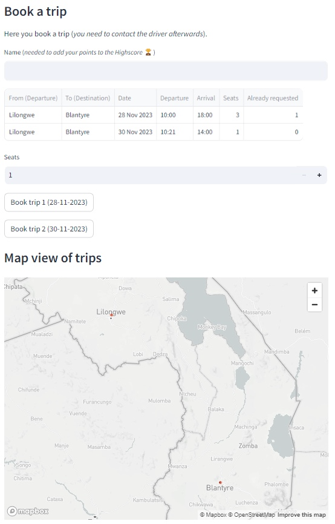

# Booking

The **Booking** menu let's you book a planned trip.

## Book a trip

Under the menu **Booking** you can find the following input fields:

- Name: *to enter your name (Highscore 🏆)*
- Seats: *to select the number of seats to want to book*

Click on the **Button** of a matching trip to book and to get the credentials of the driver. It is still needed to contact the driver to plan the meeting time and the meetup point for this particular trip.

### Map view

A map is displayed to show you starting and end points of the available trips.

### Gamification

Your booking results in **5 points** which will be added under your name to the Highscore list. Be aware that your name needs to 100% match, if it is not your first offering to be accumulated to the same person on the Highscore list.
