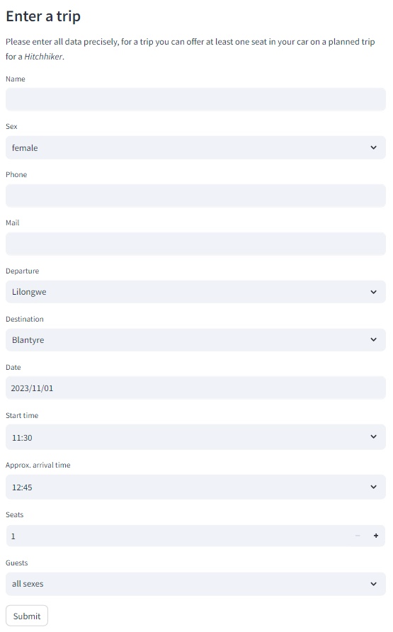

# Driving

The **Driving** menu let's you promote seats that you offer on a planned trip. Please just enter a trip, if the chance of success is quite high to prevent bad experiences for the users of this App.

## Create a trip

Under the menu **Driving** you can find the following input fields:

- Name: *to enter your name*
- Sex: *to select your sex*
- Phone: *to enter your phone number*
- Mail: *to enter your email address*
- Departure: *to select your starting point*
- Destination: *to select your destination*
- Date: *to select the date of your trip*
- Start time: *to select the start time of your trip*
- Approx. arrival time: *to select the approximate arrival time of your trip*
- Seats: *to select the number of free seats available in your car*
- Guests: *to choose if this trip is just for female guests (only available if driver is female)*

Press the **Submit** button to write your trip to the database so that other users can find it.

### Cities

You can select out of following cites:

*Lilongwe, Balaka, Blantyre, Chikhwawa, Chitipa, Dedza, Dowa, Karonga, Kasungu, Machinga, Mangochi, Mchinji, MonkeyBay, Mulanje, Mwanza, Mzimba, Mzuzu, Neno, NkahataBay, Nkhotakota, Nsanje, Ntcheu, Ntchisi, Phalombe, Rumphi, Salima, Thyolo, Zomba.*

This offers **distance calculation** for your trip and also let the planner find matching trips, even if your **starting** and **end points** are **not the same** as the offered trip (if your Departure and Destination is on the route).

If your departure or destination is not in this list, please choose the cities quite next to it as departure / destination.

### Gamification

Your offering results in **10 points** which will be added under your name to the Highscore 🏆 list. Be aware that your name needs to 100% match, if it is not your first offering to be accumulated to the same person on the Highscore list.
