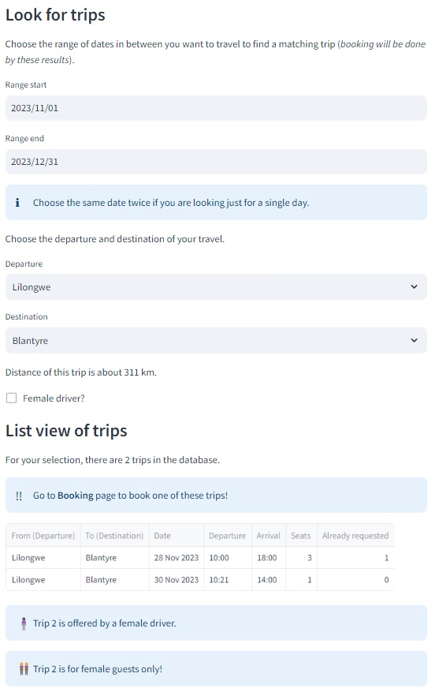

# Hitchhiking

The **Hitchhiking** menu let's you find planned trips.

## Find a trip

Under the menu **Hitchhiking** you can find the following selections:

- Range start: *to select the date of the trip you are looking for*
- Range end: *to select the end date of the range if you are flexible to choose of several days of traveling*
  (Choose twice the same to just look for a trip on one particular day!)
- Departure: *to select the starting point of the trip you are looking for*
- Destination: *to select the ending point of the trip you are looking for*
- Female driver: *to select if you are looking for a female driver*
- Only female guests: *to choose if the trip is just for female guests*

If you don't find a trip try to change the parameters slightly (for instance choose an alternate date).

### Cities

You can select out of following cites:

*Lilongwe, Balaka, Blantyre, Chikhwawa, Chitipa, Dedza, Dowa, Karonga, Kasungu, Machinga, Mangochi, Mchinji, MonkeyBay, Mulanje, Mwanza, Mzimba, Mzuzu, Neno, NkahataBay, Nkhotakota, Nsanje, Ntcheu, Ntchisi, Phalombe, Rumphi, Salima, Thyolo, Zomba.*

This offers distance calculation for your trip and also let the planner find matching trips, even if your starting and end points are not the same as the offered trip (if your Departure and Destination is on the route).

If your departure or destination is not in this list, please choose the cities quite next to it as departure / destination.
