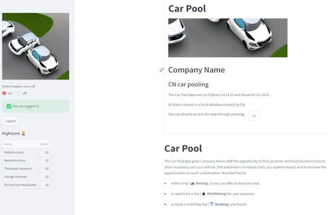

# Car Pool App

The Car Pool App gives the staff the opportunity to find, propose and book business trips to share resources such as a vehicle, fuel and drivers to reduce costs, eco-system impact and to increase the opportunities to reach a destination.

## Table of contents

In this help you can choose out of the following sections:

- [Driving](Driving.html) (how to offer a trip)
- [Hitchhiking](Hitchhiking.html) (how to find a matching trip)
- [Booking](Booking.html) (how to book a trip)
- [About](About.html) (Information about the dev)
- [README](README.html) (technical instructions)
- [CHANGELOG](CHANGELOG.html) (Version information)
- [LICENSE](LICENSE.html) (GPL-3.0)

